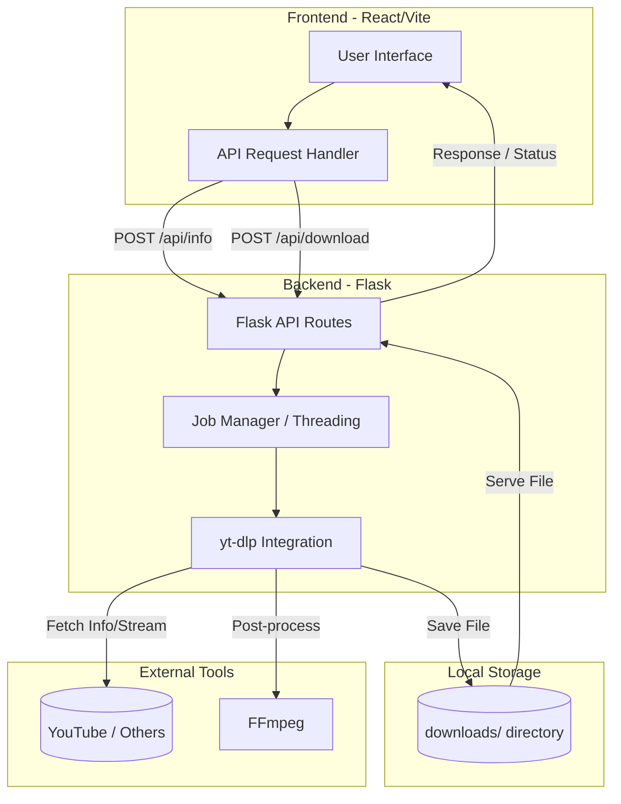

# YTForge

YTForge is a powerful web-based interface for `yt-dlp`, allowing you to easily download videos, extract audio, and manage downloads from various platforms.

## Features

- **Video Downloads**: Download videos in various formats and resolutions.
- **Audio Extraction**: Extract high-quality audio in multiple formats (MP3, etc.).
- **Metadata Retrieval**: View video information, thumbnails, and subtitles.
- **Modern UI**: Clean and responsive React-based frontend.

## Setup & Running

### Prerequisites

- Python 3.8+
- Node.js & npm
- FFmpeg (for video/audio processing)

### Quick Start

1. **Install Backend Dependencies**:
   ```bash
   pip install -r requirements.txt
   ```

2. **Install Frontend Dependencies**:
   ```bash
   cd frontend
   npm install
   ```

3. **Run the Application**:
   - Start the backend:
     ```bash
     python files/app.py
     ```
   - Start the frontend:
     ```bash
     cd frontend
     npm run dev
     ```

## Project Architecture & Structure



### Folder Layout

```text
YTForge/
├── files/
│   ├── app.py          # Flask Backend logic & API
│   └── run.sh          # Automation script
├── frontend/           # React Frontend (Vite)
│   ├── src/            # Components & Logic
│   └── public/         # Assets
├── downloads/          # Temporary video/audio storage
├── requirements.txt    # Python dependencies
└── README.md           # Documentation
```
